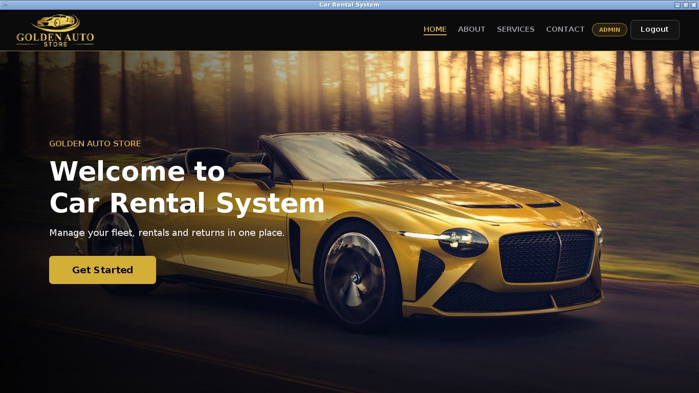
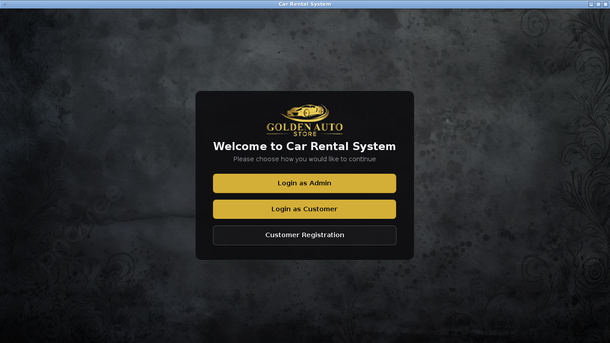
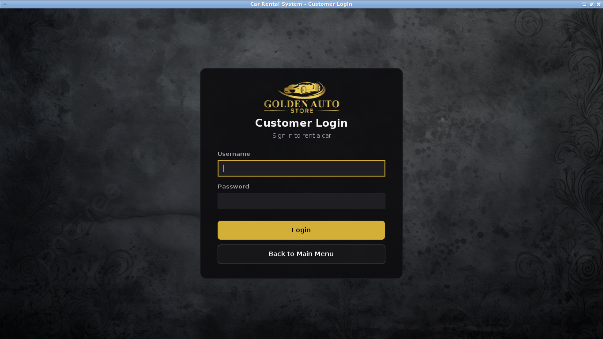
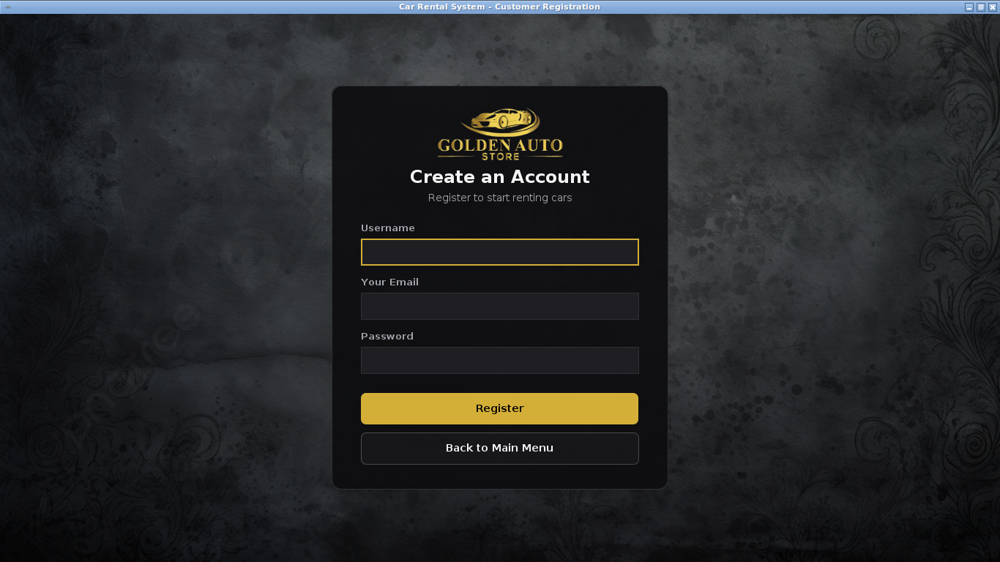
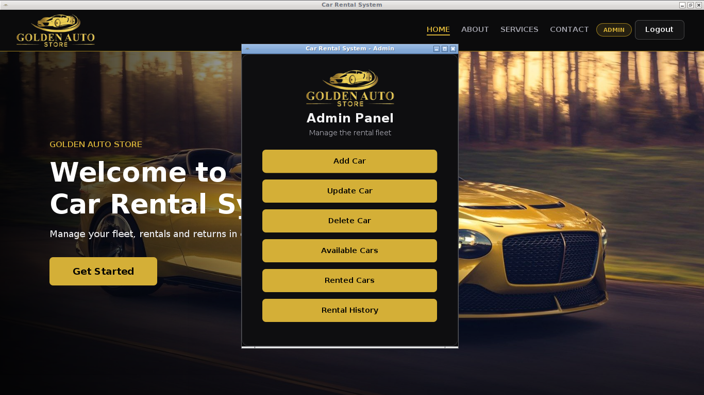
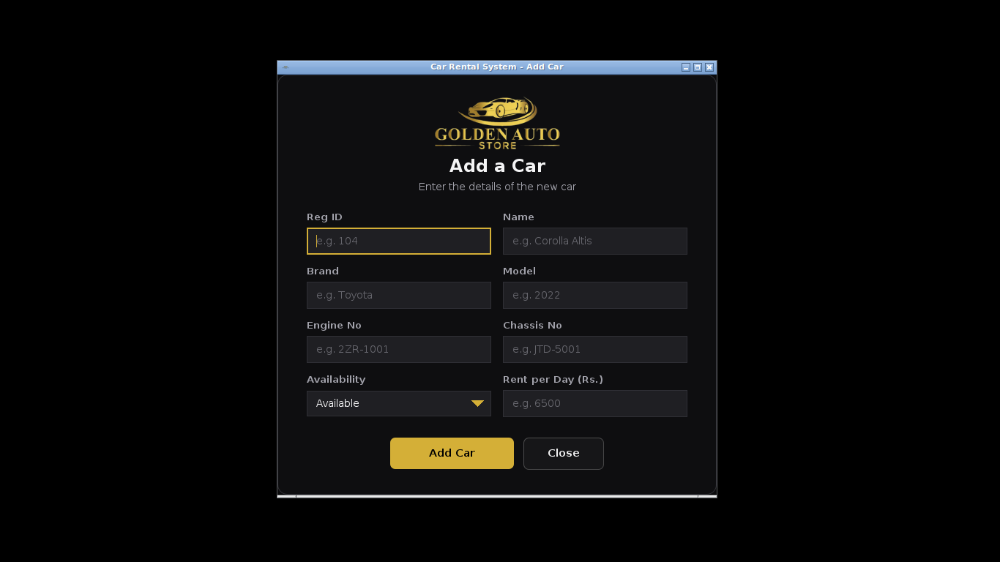
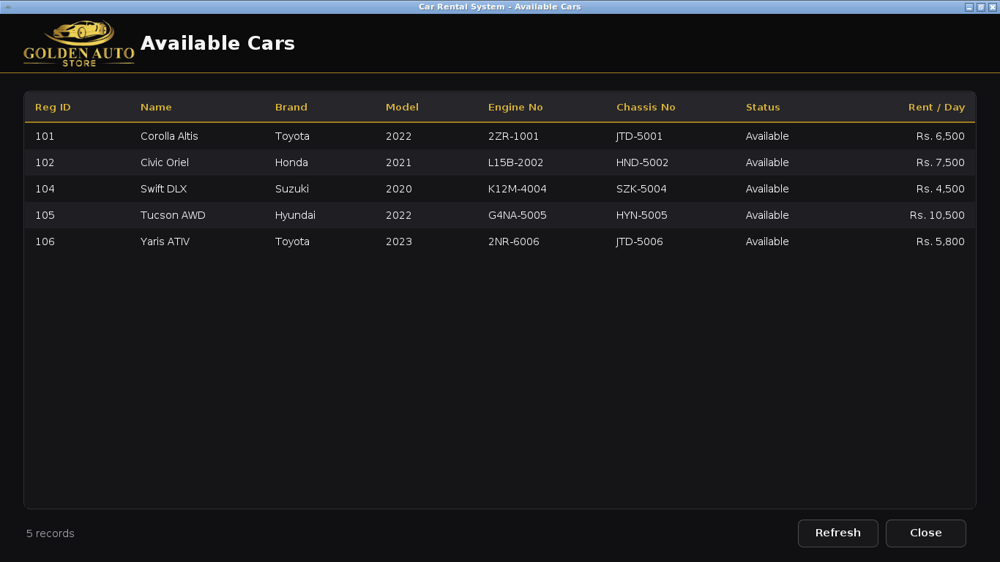
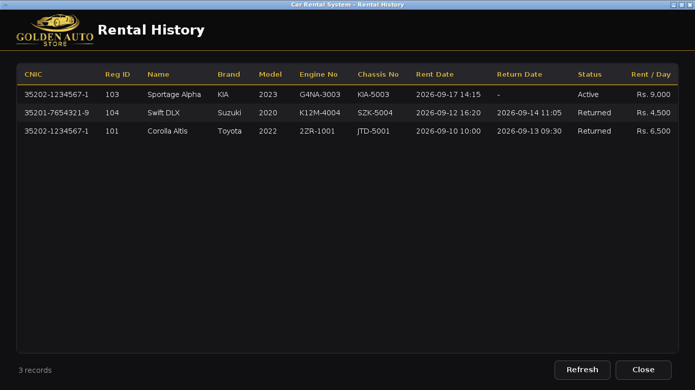
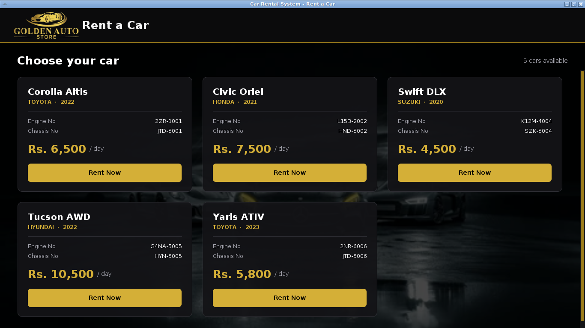
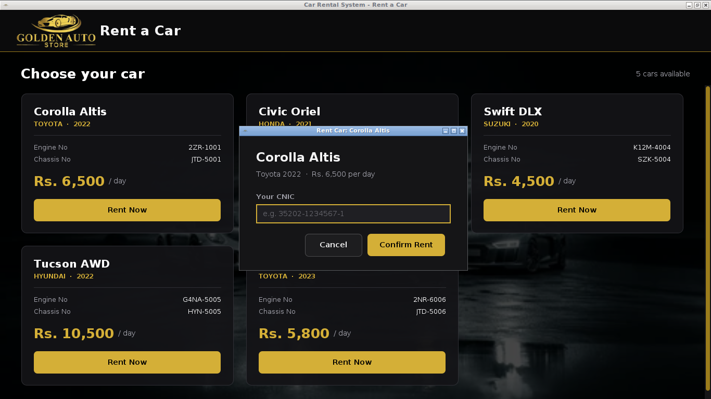

# Car Rental System

A desktop car rental application built with Java Swing and MySQL along with security assessmentreport having vulnerability findings and remediation insights made as
part of an Object-Oriented Programming course. An admin can manage a fleet of
cars; customers can browse available cars, rent one, view their rental
history and return a car.

Java 17(plus) - UI(Swing) - DataBase(MySQL)

<p align="center">
  
</p>

## Features

- **Admin**: add / update / delete cars, view available cars, view rented
  cars, view the full rental history of every customer.
- **Customer**: register an account, log in, browse available cars, rent a
  car, return a car (with an automatic price summary based on days rented),
  view their own rental history by CNIC.
- **Consistent UI**: a small reusable UI layer (`src/ui`) is used by every
  screen, so the look and feel (dark theme, gold accents) is the same across
  the whole app.
- **Responsive layout**: windows can be resized, and the car cards reflow to
  fit the available width.

## Screenshots

### Getting in

<table>
  <tr>
    <td align="center"><br><sub><b>Main menu</b></sub></td>
    <td align="center"><br><sub><b>Customer login</b></sub></td>
  </tr>
  <tr>
    <td align="center" colspan="2"><br><sub><b>Customer registration</b></sub></td>
  </tr>
</table>

### Dashboard and admin tools

<table>
  <tr>
    <td align="center"><br><sub><b>Admin panel</b></sub></td>
    <td align="center"><br><sub><b>Add a car</b></sub></td>
  </tr>
  <tr>
    <td align="center"><br><sub><b>Available cars</b></sub></td>
    <td align="center"><br><sub><b>Rental history</b></sub></td>
  </tr>
</table>

### Renting a car

<table>
  <tr>
    <td align="center"><br><sub><b>Browse available cars</b></sub></td>
    <td align="center"><br><sub><b>Confirm a rental</b></sub></td>
  </tr>
</table>

## Project structure

```
src/
  app/        entry point (App.java)
  login/      main menu, admin/customer login, customer registration
  dashboard/  the screen shown right after logging in
  admin/      admin menu and car management screens
  customer/   customer menu, rent/return/history screens
  database/   JDBC helper classes
  ui/         shared look and feel: themed buttons, fields, dialogs, tables
database/
  schema.sql  creates the car_rental database and its two tables, with a
              few sample cars
data/
  customers.txt  customer accounts (one demo account included)
docs/
  screenshots/   images used in this README
lib/          put the MySQL Connector/J jar here (not included, see below)
```

## Requirements

- JDK 17 or newer
- A running MySQL (or MariaDB) server
- [MySQL Connector/J](https://dev.mysql.com/downloads/connector/j/): download
  the `.jar` and place it in the `lib` folder (it is not committed to this
  repository; see `.gitignore`)

## Getting started

1. **Create the database.**
   ```bash
   mysql -u root -p < database/schema.sql
   ```
   This creates the `car_rental` database with a `cars` table (six sample
   cars are inserted for you) and a `rented_cars` table.

2. **Set your database credentials.**
   By default the app connects to `localhost:3306` as `root` / `root` (see
   `src/database/DBConnect.java`). Change `URL`, `USER` and `PASS` there if
   your setup is different.

3. **Add the JDBC driver.**
   Download `mysql-connector-j-*.jar` and place it in the `lib` folder.

4. **Run it.**
   - **VS Code (recommended, works on Windows, macOS and Linux):** open the
     project folder (the "Extension Pack for Java" is recommended), then run
     `app.App` or use the included "Car Rental System" launch configuration.
   - **Linux / macOS command line:** `./run.sh` (compiles and starts the app).

## Demo logins

| Role     | Username | Password   |
|----------|----------|------------|
| Admin    | `admin`  | `admin123` |
| Customer | `demo`   | `demo123`  |

You can also create your own customer account with **Customer Registration**
on the main menu. Sample CNIC to try when renting a car: `35202-1234567-1`.

## Notes

- This was a learning project, so a few simplifications are intentional: the
  admin password is hard-coded, and customer accounts are stored in a plain
  text file rather than in the database.
- SQL queries are built with basic string formatting rather than a query
  builder or ORM, which is typical for a first database-backed project.

## License

This project is provided as-is for portfolio and educational purposes.
